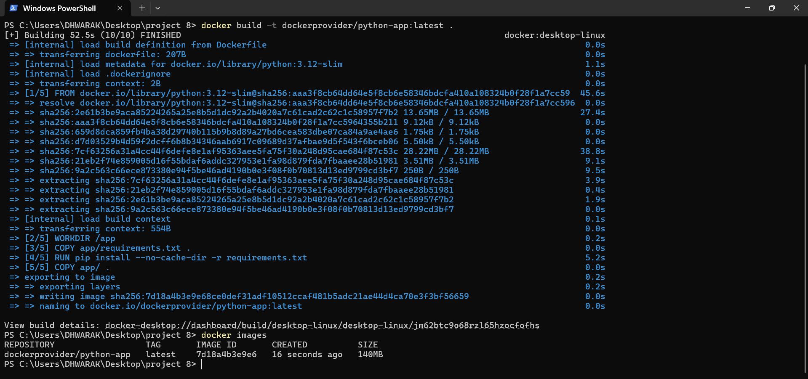
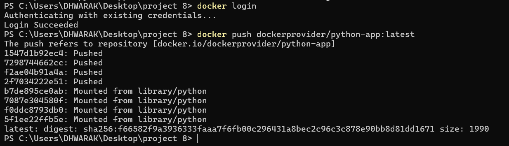
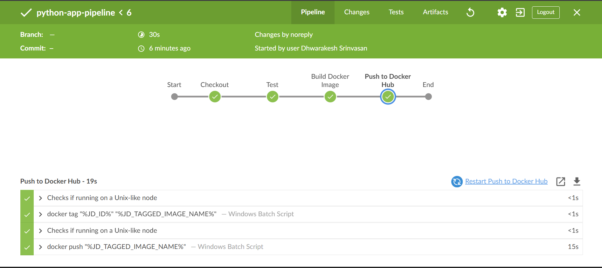
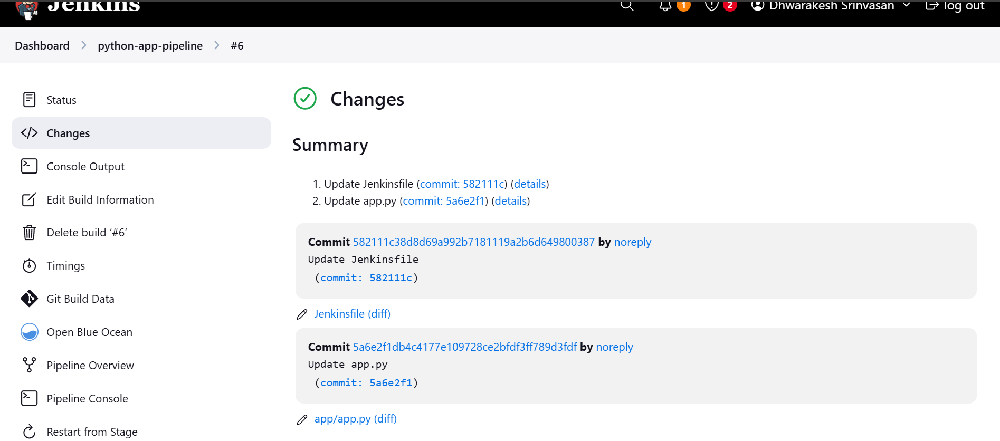

# Jenkins CI/CD Pipeline for Python Flask Application  

**Automated Dockerization, Testing, and Deployment**  

---

## 📝 Project Description  
This project demonstrates a **CI/CD pipeline** using Jenkins to automate the Dockerization, testing, and deployment of a Python Flask web application. Key features:  
- **GitHub Integration**: Auto-trigger Jenkins pipelines on code commits.  
- **Docker Image Management**: Build and push images to Docker Hub.  
- **Unit Testing**: Run `pytest` to validate application functionality.  
- **Windows Compatibility**: Configured for seamless execution on Windows environments.  

---

## 🛠 Prerequisites  
1. **Python 3.12+** (installed with `PATH` configuration).  
2. **Docker Desktop** (Windows/Mac).  
3. **Jenkins** (installed locally).  
4. **Accounts**:  
   - GitHub ([Sign up](https://github.com))  
   - Docker Hub ([Sign up](https://hub.docker.com))  

---

## 🚀 Step-by-Step Guide  

### 1. **Clone the Repository**  
```bash
git clone https://github.com/git-hub-user7/Jenkins-PythonApp-CI-CD.git
cd Jenkins-PythonApp-CI-CD
```
### 2. **Project Structure**
```   
├── app/
│   ├── app.py          # Flask application
│   ├── test_app.py     # Unit tests
│   └── requirements.txt
├── Screenshots         # Contains Project Screensnaps 
├── Dockerfile          # Docker configuration
└── Jenkinsfile         # Jenkins pipeline script
```

### 3. **Docker Setup**
- **Build the Docker Image:**
```
  docker build -t dockerprovider/python-app:latest .
```
- **Push to Docker Hub:**
```
  docker login
  docker push dockerprovider/python-app:latest
```

### 4. **Jenkins Pipeline Configuration**

**Install Plugins:**

- GitHub Integration


- Docker Pipeline


- Blue Ocean (optional)


**Create a Pipeline Job:**

- Name: `python-app-pipeline`


- GitHub Repo URL: `https://github.com/git-hub-user7/Jenkins-PythonApp-CI-CD.git`


- Branch: `main`


- Script Path: `Jenkinsfile`


**Add Credentials to Jenkins:**


- Docker Hub: Username + Personal Access Token (ID: `dockerhub-creds`).


- GitHub: Personal Access Token (ID: `github-creds`).


### 5. **Jenkinsfile**
```
pipeline {
    agent any
    environment {
        DOCKERHUB_CREDENTIALS = credentials('dockerhub-creds')
    }
    stages {
        stage('Checkout') {
            steps {
                git branch: 'main', 
                url: 'https://github.com/git-hub=user7/Jenkins-PythonApp-CI-CD.git'
            }
        }
        stage('Test') {
            steps {
                bat 'pytest app/test_app.py' // Windows-compatible
            }
        }
        stage('Build Docker Image') {
            steps {
                script {
                    dockerImage = docker.build("dockerprovider/python-app:\${env.BUILD_ID}")
                }
            }
        }
        stage('Push to Docker Hub') {
            steps {
                script {
                    docker.withRegistry('https://registry.hub.docker.com', 'dockerhub-creds') {
                        dockerImage.push()
                    }
                }
            }
        }
    }
}
```
### 6. **Automate with GitHub Webhook**

- Go to GitHub Repo → Settings → Webhooks.

- Add a webhook with:

- Payload URL: `http://<your-jenkins-ip>:8080/github-webhook/`

- Trigger: Just the push event

--- 

## 📸 **Screenshots** 

- ### Output of the docker build command
  

- ### Docker Hub repository with pushed image.
   

- ### Successful Jenkins pipeline stages.
   

- ### Testing Successful Syncing Result
  

---

## 🔧 **Troubleshooting**

- If authentication failed, use Docker Hub/GitHub Personal Access Tokens.

- If sh: command not found, replace sh with bat in Jenkinsfile.

- If docker push denied, verify credentials in Jenkins.

- If pytest not found, install pytest globally: pip install pytest.

---

## 🖥 Technologies Used

📦Jenkins (CI/CD Automation)

📦Docker (Containerization)

📦Python 3.12 (Flask Web Framework)

📦GitHub (Version Control & Webhooks)

## 👨‍💻 Author  

**Dhwarakesh Srinivasan**  

- 📧 Email: `dhwarakesh99@gmail.com`  

- 💼 LinkedIn: [www.linkedin.com/in/dhwarakesh-srinivasan-361719292](www.linkedin.com/in/dhwarakesh-srinivasan-361719292)  

- 🐙 GitHub: [git-hub-user7](https://github.com/git-hub-user7)  
